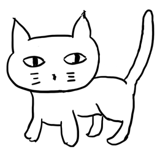

# ねこ



Neko can tell if an article was written by a specific author.

Don't trust it though. It can't assure you the correctness, and the algorithm used is __EXTREMELY NAIVE__.

By calculating metrics from the articles by the author, it thinks it can understand the written sytle of the author.
But it doesn't know a damn, at all.

## How to build

### Prequisities

  1. Qt Library
  2. libfann
  3. C++ compiler suports C++11

### Build Steps

```
qmake
make -j
```

Or choose the visual interactive way, open `neko.pro` with Qt Creator.

### Configuration

You must have the dictionary files under ~/.neko/dict. Create the directories by yourself and download these dics:

  - https://github.com/yanyiwu/cppjieba/blob/master/dict/jieba.dict.utf8 as `~/.neko/dict/dict.utf8`
  - https://github.com/yanyiwu/cppjieba/blob/master/dict/hmm_model.utf8 as `~/.neko/dict/hmm.utf8`
  - http://pan.baidu.com/s/1o6A0BWY as `~/.neko/dict/user.dict.utf8`

## Cats

### 文乃 (fumino)

`Fumino` is the article metrics calculator (and the only subdir links to the Qt Library).
Feed it with the path contains *.txt, it will give out the metrics file.

__NOTE:__ Make sure your input files are in UTF-8, or fumino will throw a lot of NaNs on your face.

```
./fumino input_file_path [outputfile]
```

To combine multiple outputfile, just `cat` them together.

__WARNING:__ Never use the output files across versions. It's supposed to be broken.

### 希 (nozomi)

`Nozomi` trains the FFNN.

```
./nozomi metrics_this_author metrics_not_this_author trained_data_to_save
```

My test shows that ~20 articles will give some good results.

### 千世 (chise)

`Chise` contains some test data and should be run after the training.
To modify the test dataset, you need to edit the code. The data is hard coded.

```
./chise trained_data_of_the_author
```

### MetricsReader

`MetricsReader` reads the output file of `fumino`.

```
./metricsreader fumino_output
```

The last line is the average of data above.

### Jieba

The library for cutting the sentence. For the sake of clarity I made it as a subdir project. It won't produce binary though.

## License

```
Copyright (c) 2015 Afa.L Cheng <afa@afa.moe>

Permission is hereby granted, free of charge, to any person obtaining
a copy of this software and associated documentation files (the
"Software"), to deal in the Software without restriction, including
without limitation the rights to use, copy, modify, merge, publish,
distribute, sublicense, and/or sell copies of the Software, and to
permit persons to whom the Software is furnished to do so, subject to
the following conditions:

The above copyright notice and this permission notice shall be
included in all copies or substantial portions of the Software.

THE SOFTWARE IS PROVIDED "AS IS", WITHOUT WARRANTY OF ANY KIND,
EXPRESS OR IMPLIED, INCLUDING BUT NOT LIMITED TO THE WARRANTIES OF
MERCHANTABILITY, FITNESS FOR A PARTICULAR PURPOSE AND
NONINFRINGEMENT. IN NO EVENT SHALL THE AUTHORS OR COPYRIGHT HOLDERS BE
LIABLE FOR ANY CLAIM, DAMAGES OR OTHER LIABILITY, WHETHER IN AN ACTION
OF CONTRACT, TORT OR OTHERWISE, ARISING FROM, OUT OF OR IN CONNECTION
WITH THE SOFTWARE OR THE USE OR OTHER DEALINGS IN THE SOFTWARE.
```

This project includes the code from `CppJieba`, which is licensed under MIT.

```
The MIT License (MIT)
Copyright © 2015 Yanyi Wu <i@yanyiwu.com>

Permission is hereby granted, free of charge, to any person obtaining a copy
of this software and associated documentation files (the “Software”), to deal
in the Software without restriction, including without limitation the rights
to use, copy, modify, merge, publish, distribute, sublicense, and/or sell
copies of the Software, and to permit persons to whom the Software is
furnished to do so, subject to the following conditions:

The above copyright notice and this permission notice shall be included in
all copies or substantial portions of the Software.

THE SOFTWARE IS PROVIDED “AS IS”, WITHOUT WARRANTY OF ANY KIND, EXPRESS OR
IMPLIED, INCLUDING BUT NOT LIMITED TO THE WARRANTIES OF MERCHANTABILITY,
FITNESS FOR A PARTICULAR PURPOSE AND NONINFRINGEMENT. IN NO EVENT SHALL THE
AUTHORS OR COPYRIGHT HOLDERS BE LIABLE FOR ANY CLAIM, DAMAGES OR OTHER
LIABILITY, WHETHER IN AN ACTION OF CONTRACT, TORT OR OTHERWISE, ARISING FROM,
OUT OF OR IN CONNECTION WITH THE SOFTWARE OR THE USE OR OTHER DEALINGS IN
THE SOFTWARE.
```

This project links to FANN and Qt, which are licensed under LGPL.
